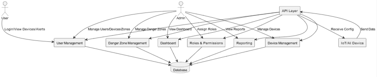
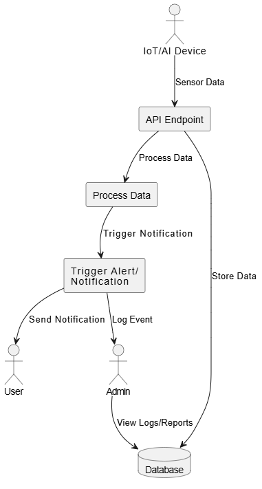
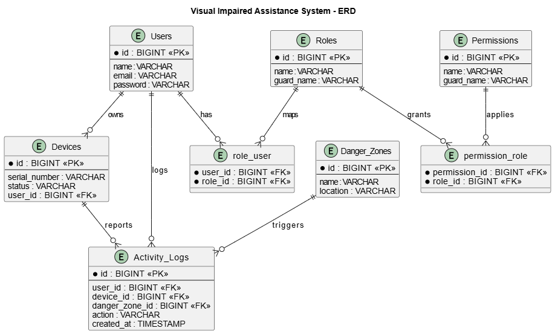

# VisualImpairedAssistance - Project Overview

## Project Description

VisualImpairedAssistance is a web-based management system designed to support and monitor devices, users, and zones for visually impaired individuals. The platform provides an admin dashboard for managing users, assigning roles and permissions, tracking devices, and monitoring danger zones. The system aims to enhance accessibility, safety, and administrative control for organizations supporting visually impaired users.

---

## Requirements

- **PHP 8.1+**
- **Laravel 12.x**
- **MySQL or compatible database**
- **Node.js & npm (for frontend assets)**
- **Vite (for asset bundling)**
- **Bootstrap 5 & Font Awesome (UI)**
- **Spatie Laravel Permission (roles/permissions)**
- **AdminLTE (admin dashboard UI)**
- **Browser (Chrome, Firefox, Edge, etc.)**

---

## Main Functionalities

- **User Management**
  - Create, edit, delete, and view users
  - Assign roles and permissions to users
  - Track active and inactive users

- **Device Management**
  - Register and manage devices
  - Assign devices to users

- **Danger Zone Management**
  - Define and monitor danger zones
  - View statistics and reports on danger zones

- **Roles & Permissions**
  - Manage roles (admin, user, etc.)
  - Assign and revoke permissions using Spatie package

- **Reports**
  - Generate and view reports on users, devices, and zones
  - **Download reports as PDF or Excel files** for further analysis or sharing

- **Dashboard**
  - Visual overview of total users, devices, danger zones, and active users
  - User statistics and recent activity feed

- **Authentication & Security**
  - Secure login/logout
  - Role-based access control

---

## AI and IoT Integration

The **AI and IoT components** of the system are designed to be implemented directly on the physical devices used by visually impaired individuals. These devices will:

- **IoT Functionality:**  
  Collect real-time data from sensors (such as location, proximity, or environmental hazards) and communicate with the web platform for monitoring and alerts.
- **AI Functionality:**  
  Process sensor data locally or in the cloud to provide intelligent assistance, such as obstacle detection, voice guidance, or predictive alerts.

**Implementation Details:**
- The web application (this Laravel project) manages device registration, user assignments, and receives data from IoT devices.
- The AI and IoT logic (such as sensor data processing, AI-based guidance, etc.) will be programmed and deployed on the devices themselves (e.g., using Python, C++, or embedded systems).
- Devices will communicate with the Laravel backend via APIs for data synchronization, reporting, and remote monitoring.

---

## Additional Features

- **Report Export:**  
  All generated reports can be downloaded in **PDF** and **Excel** formats, making it easy to share or archive important data.
- **Extensible Design:**  
  The system is built to allow future integration of more advanced AI features, additional device types, and new reporting formats.
- **User-Friendly Interface:**  
  The dashboard and management screens are designed for clarity and accessibility, supporting both technical and non-technical users.

---

## How to Run

1. Clone the repository.
2. Install PHP and Node.js dependencies:
   ```
   composer install
   npm install
   ```
3. Copy `.env.example` to `.env` and set your database credentials.
4. Run migrations and seeders:
   ```
   php artisan migrate --seed
   ```
5. Build frontend assets:
   ```
   npm run dev
   ```
6. Start the Laravel server:
   ```
   php artisan serve
   ```
7. Access the app at [http://127.0.0.1:8000](http://127.0.0.1:8000)

---

## Logical Design Overview

VisualImpairedAssistance is logically divided into several core modules, each with clear responsibilities and interfaces. This modular approach ensures maintainability, scalability, and ease of integration with external (mobile/IoT) devices.

---

### 1. **Core Modules**

#### **A. User Management**
- Handles user registration, authentication, and profile management.
- Supports role-based access control (admin, user, etc.).
- Allows assignment of devices to users.

#### **B. Device Management**
- Registers and manages IoT/AI devices.
- Assigns devices to users.
- Receives and stores device data (location, status, sensor readings).

#### **C. Danger Zone Management**
- Allows admins to define, edit, and monitor danger zones.
- Associates danger zones with device/user activity.

#### **D. Roles & Permissions**
- Uses Spatie Laravel Permission for flexible role and permission assignment.
- Controls access to all system features.

#### **E. Reporting**
- Generates reports on users, devices, and danger zones.
- Allows export of reports as PDF and Excel files.

#### **F. Dashboard**
- Provides visual summaries (counts, charts, recent activity).
- Displays user statistics and system health.

#### **G. API Layer**
- Exposes RESTful endpoints for device and mobile app integration.
- Handles secure data exchange between devices and the backend.

---

### 2. **Integration with Mobile Devices and IoT/AI**

#### **Why Integration is Easy**
- **API-Driven:** All device and mobile interactions use RESTful APIs, making it easy for any platform (Android, iOS, embedded) to connect.
- **Standard Protocols:** Uses HTTP(S) and JSON for communication.
- **Authentication:** Secure token-based authentication for devices and users.
- **Modular:** Device logic is decoupled from the web platform, so new device types or features can be added without changing the core system.

#### **Device Responsibilities**
- **IoT Devices:** Collect sensor data (e.g., GPS, obstacles), send to backend, receive configuration/alerts.
- **AI Devices:** Process sensor data locally (e.g., obstacle detection, voice guidance), provide real-time feedback, optionally send processed results to backend.
- **Mobile Apps:** Bridge between user and device, display alerts/statistics, allow user/caregiver interaction.

#### **Integration Flow**
1. **Device Registration:** Admin registers device and assigns to user via dashboard.
2. **Data Collection:** Device collects/processes data (AI/IoT).
3. **Data Transmission:** Device sends data to backend via API.
4. **Backend Processing:** Backend stores data, triggers alerts, updates dashboard.
5. **User Feedback:** Device/mobile app provides real-time feedback to user; caregivers can monitor via dashboard or app.
6. **Reporting:** Admin generates and exports reports as PDF/Excel.

---

### 3. **Logical Data Flow**

1. **Admin/User logs in** → Accesses dashboard and management features.
2. **Device collects data** → Sends to backend via API.
3. **Backend processes data** → Stores in database, updates dashboard, triggers alerts if needed.
4. **Reports generated** → Can be downloaded as PDF/Excel.
5. **Mobile app/device receives updates** → Provides feedback to user.

---

### 4. **Entities and Relationships**

- **User**: Has roles, can own devices, generates activity logs.
- **Device**: Assigned to user, sends data, can be linked to danger zones.
- **Danger Zone**: Defined by admin, linked to device/user activity.
- **Role/Permission**: Assigned to users for access control.
- **Activity Log**: Records user/device actions for reporting and auditing.

---

### 5. **Summary**

- **Separation of Concerns:** Each module (users, devices, zones, reports) is logically separated.
- **Easy Integration:** API-first design enables seamless connection with mobile and IoT/AI devices.
- **Extensible:** New device types, AI features, or reporting formats can be added without major changes.
- **Secure:** Role-based access and secure API endpoints.
- **User-Friendly:** Dashboard and reports are accessible and exportable.

---

**In summary:**  
The logical design ensures that the system is robust, maintainable, and ready for integration with a wide range of mobile and IoT/AI devices. Devices handle data collection and AI processing, while the web platform manages users, devices, zones, and reporting, all connected through secure and well-defined APIs.

---

## Data Flow Diagrams (DFD)

### Level 0: Context Diagram


### Level 1: Main Processes


### Level 2: Device Data Flow Example


---

## Entity Relationship Diagram (ERD)

